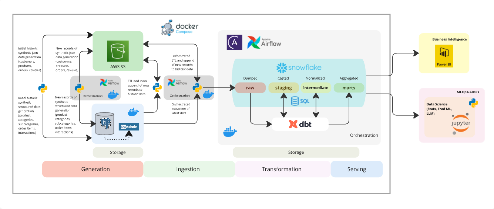

## Build an End-to-End Data Engineering Pipeline for eCommerce with the Modern Data-Stack

### Introduction
In today’s data-driven world, eCommerce businesses rely on accurate and timely insights to optimize operations, enhance customer experiences, and drive growth. The exponential increase in online transactions, customer interactions, and product data poses a unique challenge: how to efficiently manage, process, and analyze this vast amount of information. A robust data engineering pipeline is the foundation of any successful eCommerce analytics strategy, enabling businesses to transform raw data into actionable insights.

This article introduces a comprehensive eCommerce data engineering solution designed to address every stage of the data engineering lifecycle, leveraging the increasingly popular concept of the Modern Data Stack. From data generation and ingestion to transformation and serving, this solution integrates cutting-edge cloud technologies like **AWS S3**, **Snowflake**, **Apache Airflow**, and **dbt**. Tailored for scalability, reliability, and adaptability, it is purpose-built to meet the dynamic and evolving demands of eCommerce businesses.

The pipeline we will be building processes synthetic datasets that simulate real-world eCommerce operations, including customer profiles, product catalogs, order histories, and customer reviews. It ensures seamless integration of historical and incremental data while transforming them into a serving model which could be utilize in downstream use cases such as dashboards, predictive models, and operational systems. This will be covered in another project and article.

Whether your goal is to build personalized recommendations, optimize inventory, or generate business intelligence reports, this data engineering solution provides the tools and framework to meet the demands of a fast-paced eCommerce environment.

In the following sections, we’ll explore how the pipeline is structured, the tools it employs, and the step-by-step flow of data through its components, showcasing how this solution transforms raw eCommerce data into a competitive advantage.

### Overview

### **1. Data Generation**

The data flow begins with two parallel streams of synthetic data generation:

**Historical Synthetic Data Generation (Initial Load):**

- **JSON Data**: Customers, products, orders, and reviews data are generated in JSON format and stored in AWS S3.
- **Structured Data**: Product categories, subcategories, order items, and interaction data are generated in a structured format and stored in **Postgres** (managed via pgAdmin on Docker).

**Latest (30-day) Synthetic Data Generation (Ongoing Operations):**

- **JSON Data**: Customers, products, orders, and reviews data are generated in JSON format and stored in AWS S3.
- **Structured Data**: Product categories, subcategories, order items, and interaction data are generated in a structured format and stored in **Postgres** (managed via pgAdmin on Docker).

### **2. Data Ingestion**

- **JSON Data from S3**: Apache Airflow orchestrates the **ETL (Extract, Transform, Load)** process, appending new JSON records from S3 to historical data, and loading them to the historical data in S3 and Snowflake raw schema.
- **Structured Data from Postgres**: Airflow also orchestrates the **ETL** process, appending new structured records from Postgres to historical data, and loading to the historical data in S3 and Snowflake raw schema.

### **3. Data Transformation**

The ingested data is processed with dbt (data build tool) and stored in Snowflake through different layers:

- **Raw Layer**: Data is first dumped in its raw form.
- **Staging Layer**: Data is casted into appropriate data types and formats.
- **Intermediate Layer**: Data is normalized to remove redundancy and ensure consistency.
- **Marts Layer**: Data is aggregated and structured into data marts for specific business use cases.

### **4. Orchestration**

- Orchestrates the latest (last 30 days) synthetic data generation and ingestion
- Orchestrates the transformations across the Snowflake layers, ensuring proper lineage and documentation.

### **5. Data Serving (Next Project)**

The processed and aggregated data is served to different downstream systems:

- **Business Intelligence**: Aggregated data marts are consumed by Power BI for reporting and dashboards.
- **Data Science**: Processed data is used in Jupyter Notebooks for machine learning, statistics, and AI operations.

See resources:
- [Demo video](https://www.canva.com/design/DAGbNyzmvUc/1T2QqUJmLWkGbqHkyZ9jHw/watch?utm_content=DAGbNyzmvUc&utm_campaign=designshare&utm_medium=link2&utm_source=uniquelinks&utlId=hb0381f7610)
- [Documentation](https://medium.com/@sclauguico/build-an-end-to-end-data-engineering-pipeline-for-ecommerce-with-a-modern-data-stack-e874d89b9906)

This project has been inspired by:
- Data Engineering Zoomcamp
- DeepLearning.AI AWS Data Engineering Professional Certificate
- IBM Data Engineering
- Joe Reis' teachings
- Jayzern's dbt-Airflow-Snowflake implementation
- Madyar Marat's Heart rate stream DE project
- Wynne Lo's Airflow and Astro article
